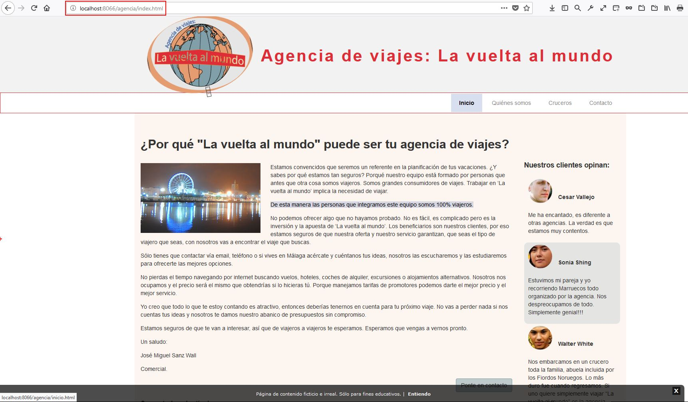
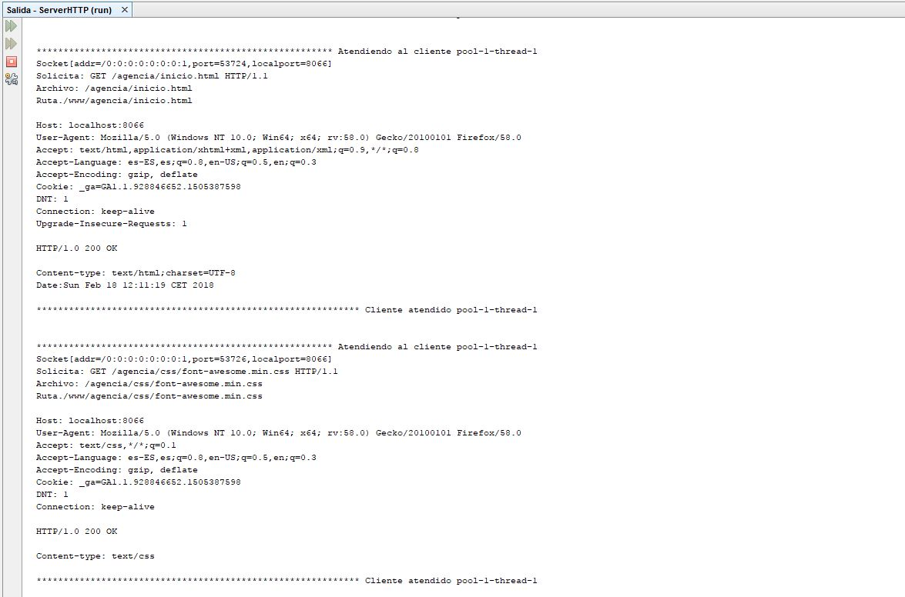

Servidor HTTP:
==============
_ _ _

Este servidor HTTP es un modelo inicial de servidor concurrente que recibe las peticiones de los navegadores (Clientes) y envía las respuestas.

Las páginas o sitios web se guardan en su carpeta /www estructurados en carpetas individuales.

_ _ _

#### Información de funcionamiento del  servidor:

- - -

El proyecto está preapado para ser ejecutado desde **NetBeans**.
- - -

El Servidor WEB se ejecuta y permanece a la escucha por el puerto 8066.

Escribe en la barra de direcciones de tu navegador preferido para cargar una página:

	http://localhost:8066/agencia/index.html

La página que se muestra es un trabajo realizado el año pasado para el módulo de DAM LMSGI en la tarea 2, que he aprovechado para utizarlo de prueba para ver como funciona este servidor.

Otras páginas disponibles:

	http://localhost:8066/prueba/index.html => Esta es la página simple creada por defecto.

	http://localhost:8066 => Esto simula una página no existente.

_ _ _

##### Imágenes:
Resultado:

- - -

Podemos ver también la información generada en la consola de NetBeans:

_ _ _

18 de febrero de 2018 12:20

_ _ _

